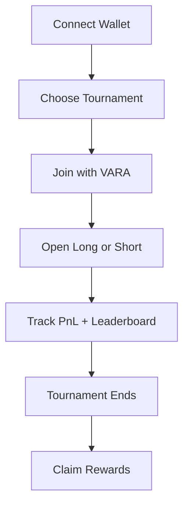
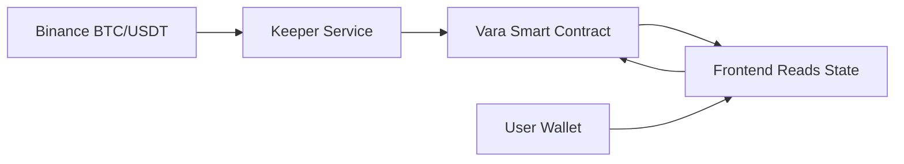
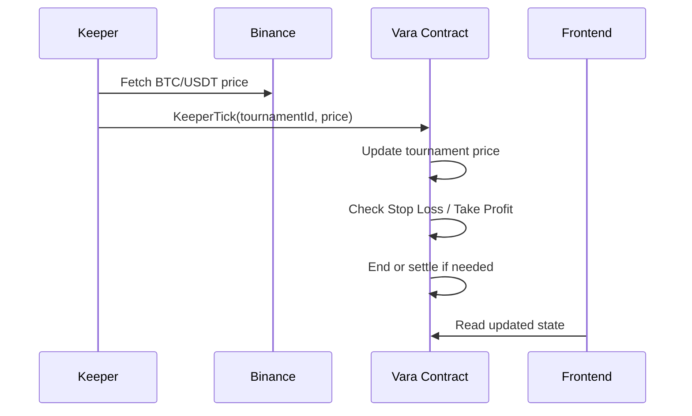
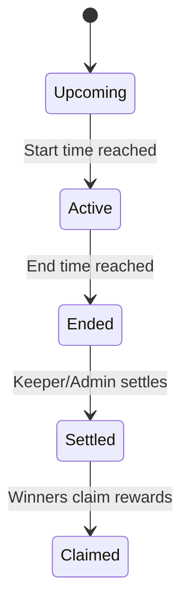

# TradeVault Arena

TradeVault Arena is an on-chain BTC trading tournament platform where users trade with virtual balances and compete for real on-chain VARA prize pools.

`MVP` `Vara Testnet` `Synthetic BTC Trading` `Keeper-Based Price Feed` `On-Chain Settlement`

## Quick Summary

TradeVault Arena turns paper trading into an on-chain competition format.

- Users pay a real VARA entry fee to join a time-bound BTC/USD tournament.
- Every participant starts with the same virtual balance.
- Traders open synthetic Long or Short BTC positions.
- The smart contract tracks PnL, ranking, Stop Loss / Take Profit execution, settlement, and reward claims.
- Winners receive real on-chain VARA rewards from the shared prize pool.

> **Important:** trading is synthetic, rewards are real, and price resolution is currently keeper-based rather than fully decentralized.

TradeVault Arena is intended for:

- beginner traders who want structured practice without real BTC execution
- crypto communities running transparent competitions
- Web3 ecosystems using tournaments for onboarding and engagement
- traders who want a verifiable performance trail
- builders, judges, and ecosystem teams evaluating Vara consumer products

## At a Glance

| Area | Current MVP |
| --- | --- |
| Network | Vara Testnet |
| Trading Type | Synthetic BTC/USD |
| Rewards | Real VARA prize pool |
| Price Feed | Keeper-based |
| Settlement | On-chain |
| Wallets | SubWallet / Polkadot.js / Talisman / Enkrypt |
| Frontend | React + TypeScript + Vite |
| Contract | Rust + Sails.rs |

## User Flow

The user journey is intentionally simple:

1. Connect a Vara-compatible wallet.
2. Choose a tournament.
3. Join by paying the entry fee.
4. Open a synthetic Long or Short BTC position.
5. Track PnL and leaderboard performance.
6. Wait for tournament completion, settlement, and reward claims.



## System Architecture

TradeVault Arena is split between smart-contract-controlled tournament logic and off-chain operational components.

- The frontend reads state and submits signed user/admin actions.
- The keeper fetches BTC/USDT off-chain and posts tournament prices on-chain.
- The contract owns PnL, SL/TP checks, ranking, lifecycle transitions, and settlement.



## Keeper Tick Flow

Each keeper update is more than a price write. It is also the tournament processing step.



## Tournament Lifecycle

Tournaments move through a compact state flow:



## On-Chain vs Off-Chain

| Part | On-chain? | Notes |
| --- | --- | --- |
| Entry fee | Yes | Paid into prize pool |
| Virtual balance | Yes | Stored in contract |
| Position | Yes | Long/Short + size + SL/TP |
| PnL | Yes | Based on posted tournament price |
| Leaderboard | Yes | Calculated from contract state |
| Settlement | Yes | Winners and rewards |
| BTC price source | Off-chain | Posted by keeper/oracle |
| UI chart | Off-chain | Binance preview |

## Resolution Method

The MVP uses a keeper to post BTC/USD prices on-chain. The contract then handles PnL, Stop Loss / Take Profit execution, ranking, and settlement. Future versions can upgrade to multi-keeper median pricing or decentralized oracle feeds.

This is the key honesty line for the current architecture:

- on-chain settlement: yes
- oracle-ready architecture: yes
- fully decentralized oracle: not yet
- real BTC custody: no
- real DEX trading: no
- guaranteed rewards: no

<details>
<summary>Trading Model</summary>

TradeVault Arena uses synthetic BTC/USD positions rather than spot or perpetual execution.

- no real BTC is bought or sold
- no order book exists in the MVP
- no DEX routing exists in the MVP
- one open position per participant keeps the state model simpler
- leverage is not part of the current MVP unless added later

**PnL formulas**

For Long:

```text
PnL = ((current_price - entry_price) / entry_price) * position_size
```

For Short:

```text
PnL = ((entry_price - current_price) / entry_price) * position_size
```

Final Value:

```text
final_value = initial_virtual_balance + realized_pnl + unrealized_pnl
```

Return %:

```text
return_percentage = ((final_value - initial_virtual_balance) / initial_virtual_balance) * 100
```

**Prize handling**

- entry fees create a real on-chain VARA prize pool
- ranking is based on Return %
- the current default payout split is 60% / 30% / 10%
- settlement assigns rewards in contract state
- winners call `ClaimReward` after settlement

</details>

## Smart Contract Overview

The contract is responsible for the tournament rules, not for external market data retrieval.

- tournament creation
- joining and prize-pool accounting
- position opening and closing
- SL/TP storage and execution checks
- PnL calculation
- leaderboard calculation
- tournament ending and settlement
- claimable reward tracking
- reward claiming
- event emission

**Current Program ID:** `0x4633e693b251d976e33631c09b9277219e032d62150684ae501d8c7f2c9a5fc7`

Program ID may change after redeploys, especially when interface or storage layout changes.

<details>
<summary>Keeper / Oracle Architecture</summary>

Smart contracts cannot fetch BTC/USD prices directly from Binance or any other web API. A separate actor must post price updates on-chain.

**Current MVP**

- server-side keeper fetches BTC/USDT from Binance
- keeper calls `KeeperTick(tournament_id, price)`
- contract updates tournament price state
- contract checks Stop Loss / Take Profit
- contract updates ranking and lifecycle state
- contract can end or settle tournaments when conditions are met

**Why this is better than frontend auto-sync**

- avoids repeated wallet prompts
- continues running when user browsers close
- keeps the keeper key off the frontend
- centralizes operational responsibility in a controlled backend process

**Upgrade path**

- multi-keeper support
- median price validation
- stale-price protection
- price jump sanity checks
- decentralized oracle integration if suitable Vara support becomes available

</details>

<details>
<summary>Smart Contract Methods</summary>

| Method | Purpose |
| --- | --- |
| `CreateTournament` | Create a new arena with rules and timings |
| `JoinTournament` | Enter a tournament and pay entry fee |
| `OpenPosition` | Open a synthetic Long or Short with optional SL/TP |
| `ClosePosition` | Close an active position |
| `KeeperTick` | Post a fresh price and process tournament logic |
| `UpdatePriceAndProcess` | Update tournament price and run processing logic |
| `ProcessTournament` | Recalculate state and lifecycle without a full manual flow |
| `EndTournament` | Mark a tournament as ended when applicable |
| `SettleTournament` | Assign winner rewards and finalize tournament state |
| `ClaimReward` | Claim a settled VARA reward |
| `Leaderboard` | Query ranked participant state |
| `Participant` | Query participant-specific tournament state |
| `Tournaments` | Query tournament records |

</details>

## Current MVP Features

- wallet connect
- create tournament
- join tournament
- live BTC price display
- synthetic Long/Short trading
- Stop Loss / Take Profit fields
- leaderboard
- vault summary
- admin panel
- settlement and claim flow
- transaction feedback
- dark black + glow green UI

## Limitations

TradeVault Arena is still an MVP and should be described carefully.

- price feed is keeper-based
- keeper downtime can make the tournament price stale
- no fully decentralized oracle yet
- no real BTC custody
- no real DEX trading
- no order book
- synthetic trading only
- mobile wallet support depends on wallet browser behavior
- the MVP is intentionally narrow and focused on BTC/USD

<details>
<summary>Security Considerations</summary>

- admin and keeper keys must never be exposed in the frontend
- `.env` secrets must never be committed
- no frontend auto-write loops
- all write actions require explicit wallet approval
- keeper permissions should stay minimal
- price manipulation risk exists in a keeper-based model and must be mitigated over time
- settlement and SL/TP paths require strong test coverage

| Area | Risk | Current / Planned Mitigation |
| --- | --- | --- |
| Keeper key handling | Key exposure | Server-side only, never bundled in frontend |
| Price sourcing | Incorrect or manipulated update | Sanity checks, stale checks, future multi-keeper median |
| User signing experience | Wallet spam | No frontend auto-sync loop |
| Settlement logic | Incorrect rewards | Contract tests and explicit settlement flow |
| Operational reliability | Keeper downtime | Manual admin fallback and stale-price UI |

</details>

<details>
<summary>Roadmap</summary>

### Phase 1: Stable MVP

- server-side keeper
- stale price protection
- price freshness UI
- reliable deployment
- clean wallet flow

### Phase 2: Trust-Minimized Price Resolution

- multi-keeper support
- median price validation
- keeper role management
- price jump protection

### Phase 3: Oracle Integration

- Pyth or Chainlink style oracle if supported on Vara
- verifiable price updates
- lower trust assumptions

### Phase 4: Trading Upgrades

- multiple tournaments
- trade history
- leaderboard share cards
- risk controls
- optional leverage or liquidation simulation
- advanced charting

### Phase 5: Reputation Layer

- trader profile
- performance history
- badges
- social extensions or capital allocation style features

</details>

<details>
<summary>FAQ</summary>

### Is trading real?

No. Trading is synthetic or paper trading. Users do not buy or sell real BTC.

### Are rewards real?

Rewards are real on-chain VARA if a tournament is funded and a participant places in a paid reward position.

### Is it fully on-chain?

Not fully. Tournament logic, ranking, settlement, and reward claims are on-chain. External price sourcing is keeper-based in the current MVP.

### What is the resolution method?

A server-side keeper fetches BTC/USDT from Binance and posts tournament prices on-chain through keeper methods.

### What happens if the keeper goes offline?

Tournament price can become stale. The UI should reflect freshness, and admin fallback actions can be used until a more resilient oracle path is added.

### Can users lose more than the entry fee?

The real user cost is the entry fee. Trading gains and losses are synthetic inside the tournament in the current MVP model.

### Why use Vara?

Vara and Gear are well suited to typed contract interfaces, event-driven workflows, and transparent state transitions for tournament logic.

### Can this support other assets?

Yes, in principle. The MVP is intentionally narrow and focused on BTC/USD to keep complexity manageable.

</details>

## Final Pitch

TradeVault Arena turns trading competitions into transparent on-chain arenas: users trade synthetic BTC with equal virtual balances, compete by Return %, and win real VARA rewards from a smart-contract-managed prize pool.
