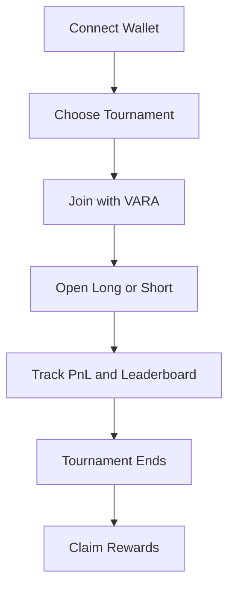
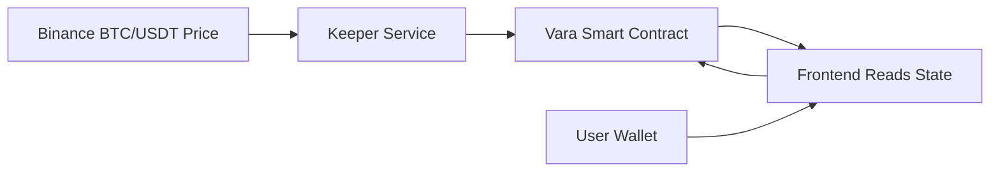
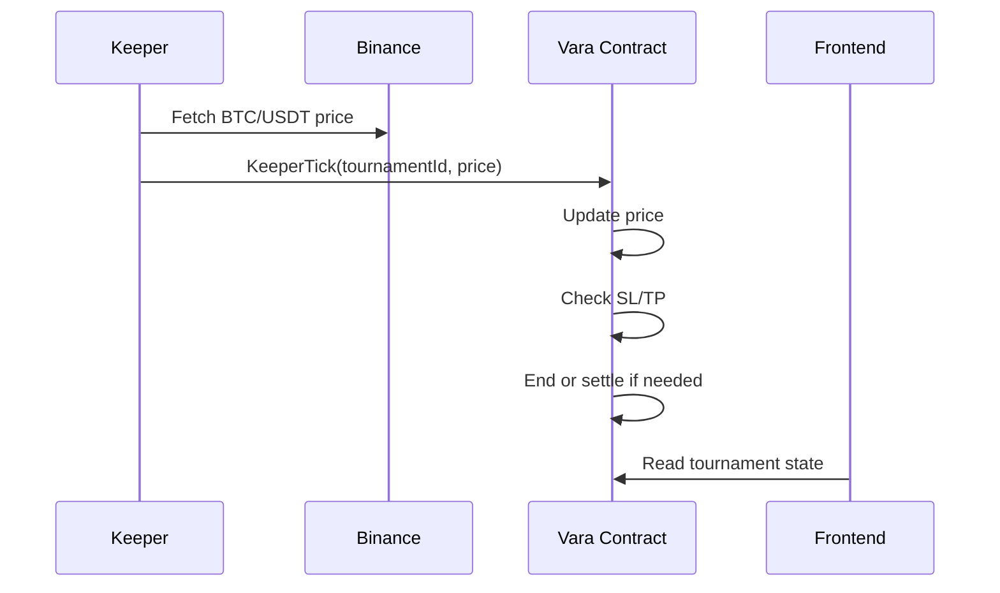
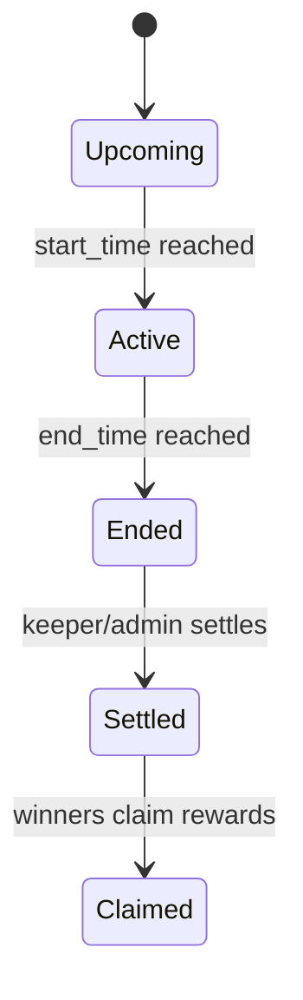

# TradeVault Arena

TradeVault Arena is an on-chain BTC trading tournament platform where users trade with virtual balances and compete for real on-chain VARA prize pools.

**What it does:** runs time-bound synthetic BTC/USD tournaments with on-chain entry fees, leaderboard logic, settlement, and claimable rewards.

**Why it matters:** most trading competitions rely on private databases and manual prize handling. TradeVault Arena moves the core tournament rules and rewards on-chain while keeping trading simple enough for an MVP.

**Status:** `MVP` `Vara Testnet` `Keeper-Based Price Feed` `On-Chain Settlement`

## Snapshot

| Area | Current MVP |
| --- | --- |
| Network | Vara Testnet |
| Trading Type | Synthetic BTC/USD |
| Rewards | Real VARA prize pool |
| Price Feed | Keeper-based |
| Settlement | Smart contract |
| Wallets | SubWallet / Polkadot.js / Talisman / Enkrypt |
| Frontend | React + TypeScript + Vite |
| Contract | Rust + Sails.rs |

| Part | On-chain? | Notes |
| --- | --- | --- |
| Entry fee | Yes | Paid into prize pool |
| Virtual balance | Yes | Stored in contract |
| Position | Yes | Long/Short + size + SL/TP |
| PnL | Yes | Based on posted tournament price |
| Leaderboard | Yes | Calculated from contract state |
| Settlement | Yes | Winners and rewards |
| BTC price source | No | Posted by keeper/oracle |
| UI chart | No | Binance preview |

## 1. Project Overview

TradeVault Arena is a tournament-based trading application built on Vara Network.

- Users join a BTC/USD arena by paying a real VARA entry fee.
- Everyone starts with the same virtual trading balance.
- Traders open synthetic Long or Short BTC positions.
- The contract tracks performance by Return %.
- Winners receive real on-chain VARA rewards from the shared prize pool.

This is not real BTC trading.

- Trading is synthetic or paper trading.
- Prize pools and payouts are real on-chain VARA.
- Tournament accounting, PnL, ranking, SL/TP checks, settlement, and claims are contract-managed.

### Who It Is For

- Beginner traders who want lower-risk practice.
- Crypto communities running trading competitions.
- Web3 ecosystems running gamified onboarding.
- Traders who want verifiable performance history.
- Projects that want tournament-based engagement.
- Builders, judges, and ecosystem teams evaluating Vara consumer apps.

### Simple Example

1. A user connects a Vara wallet.
2. The user joins an upcoming tournament with VARA.
3. The tournament starts with equal virtual balances for all players.
4. The user opens a synthetic BTC Long or Short.
5. A keeper posts BTC price updates on-chain.
6. The contract updates PnL, SL/TP, and leaderboard state.
7. The tournament ends and winners are settled.
8. Winning users claim VARA rewards.

## 2. Problem Statement

Most trading competitions are easy to launch but hard to trust.

- Leaderboards usually depend on centralized databases.
- Users cannot independently verify whether rankings were fair.
- Operators can manually adjust scores or prize decisions.
- Prize distribution is often handled off-chain and manually.
- Paper trading rarely produces a verifiable on-chain record.
- Many competitions offer no meaningful reward beyond screenshots.

TradeVault Arena exists to make tournament logic and prize handling more transparent without pretending the current MVP is fully decentralized.

## 3. Proposed Solution

TradeVault Arena combines simple synthetic trading with on-chain tournament accounting.

- Tournaments are time-bound.
- Users pay real entry fees.
- Entry fees form one shared prize pool.
- Every participant starts with the same virtual capital.
- Trading is synthetic BTC/USD, not spot or perp execution.
- Ranking is derived from contract state.
- Settlement is handled by the contract.
- Winners claim rewards directly on-chain.

## 4. How It Works

1. **Create tournament**  
   Admin defines start time, end time, entry fee, participant cap, and starting balance.
2. **Join tournament**  
   Users pay the entry fee before the arena starts.
3. **Start with virtual balance**  
   Every participant begins with equal synthetic capital.
4. **Open Long or Short BTC position**  
   Users trade based on the tournament price stored on-chain.
5. **Optional Stop Loss / Take Profit**  
   SL/TP levels are stored with the position.
6. **Keeper updates tournament price**  
   A server-side keeper fetches BTC/USDT and posts it on-chain.
7. **Contract updates PnL and leaderboard**  
   The contract recalculates tournament state.
8. **Tournament ends**  
   End-of-tournament conditions are reached.
9. **Winners are settled**  
   Rewards are assigned in contract state.
10. **Rewards are claimed**  
   Winners call `ClaimReward`.

## 5. Flows

### User Flow



- Connect a Vara-compatible wallet.
- Browse upcoming, live, ended, or settled tournaments.
- Join before start time.
- Open a synthetic Long or Short BTC position.
- Track PnL, ranking, and price freshness.
- Claim rewards after settlement if eligible.

### Admin Flow

- Create tournaments.
- Monitor tournament state.
- Manage fallback lifecycle actions.
- Manually sync and process tournaments if automation fails.
- Settle as fallback if needed.
- Manage keeper wallets in the keeper-role architecture.

### Demo Flow

1. Open the app.
2. Connect wallet.
3. Join tournament.
4. Admin or keeper syncs price on-chain.
5. Open Long or Short.
6. Watch PnL and leaderboard update.
7. Trigger SL/TP or wait for the end.
8. Settle tournament.
9. Claim reward.

## 6. Architecture

### System Architecture



### Keeper Tick Sequence



### Tournament Lifecycle



## 7. On-Chain and Off-Chain Split

### On-Chain Responsibilities

- Tournament creation
- Joining and prize-pool accounting
- Position opening and closing
- SL/TP storage and execution checks
- PnL calculation
- Leaderboard calculation
- Tournament end and settlement
- Claimable reward tracking
- Reward claiming
- Event emission

### Off-Chain Responsibilities

- Frontend UI and wallet connection
- Binance live BTC price preview
- Keeper service for price posting
- Operational monitoring and fallback actions
- IDL/client integration for contract calls

### Frontend Rule

- Frontend reads state and signs user/admin actions.
- Frontend should not auto-sign keeper writes.
- Users should never be responsible for posting tournament prices.

<details>
<summary>Trading Model</summary>

### Core Model

- Trading is synthetic BTC/USD.
- There is no real BTC custody.
- There is no DEX execution in the MVP.
- The current MVP keeps the state model simple with one open position per participant at a time.
- No leverage is part of the MVP unless explicitly added later.

### PnL Formulas

For Long:

```text
PnL = ((current_price - entry_price) / entry_price) * position_size
```

For Short:

```text
PnL = ((entry_price - current_price) / entry_price) * position_size
```

Final Value:

```text
final_value = initial_virtual_balance + realized_pnl + unrealized_pnl
```

Return %:

```text
return_percentage = ((final_value - initial_virtual_balance) / initial_virtual_balance) * 100
```

### Stop Loss / Take Profit

- SL/TP is stored on-chain with each position.
- When a new tournament price is posted, the contract checks whether SL or TP has been hit.
- Matching positions can be auto-closed during keeper processing.

</details>

## 8. Prize Pool and Settlement

- Entry fees go into a real on-chain VARA prize pool.
- Top performers receive rewards after settlement.
- Current default split is `60% / 30% / 10%` for first, second, and third place.
- Settlement happens through the contract.
- Users claim rewards after settlement instead of being paid manually.

| Item | Description |
| --- | --- |
| Entry fee | Paid in real VARA by each participant |
| Prize pool | Sum of collected tournament entry fees |
| Ranking basis | Return percentage |
| Current payout split | 60% / 30% / 10% |
| Reward claim model | Winners claim after settlement |

<details>
<summary>Keeper / Oracle Architecture</summary>

### Why a Keeper Is Needed

Smart contracts cannot fetch BTC/USD prices directly from Binance or any other external API. A separate actor must post the price on-chain.

### Current MVP Plan

- A server-side keeper fetches BTC/USDT from Binance.
- The keeper calls `KeeperTick(tournament_id, price)`.
- The contract updates tournament price state.
- The contract processes SL/TP checks, ranking effects, and lifecycle transitions.
- The contract can end or settle tournaments when conditions are met.

### Current Production Direction

- Frontend only reads state and signs user actions.
- Keeper wallet is server-side only.
- Trading should be disabled if on-chain price becomes stale.
- Manual admin sync/process remains as fallback, not as the primary path.

### Future Upgrade Path

- Multi-keeper support
- Median price validation
- Stronger stale-price protection
- Price jump sanity checks
- Decentralized oracle integration such as Pyth or Chainlink if suitable Vara integrations become available

### Important Honesty

TradeVault Arena has on-chain tournament logic and settlement, but the MVP price source is still keeper-based. It should not be described as fully decentralized until price resolution is more trust-minimized.

</details>

## 9. User and Admin Actions

### User Actions

- `JoinTournament`
- `OpenPosition`
- `ClosePosition`
- `ClaimReward`

### Admin Actions

- `CreateTournament`
- `AddKeeper`
- `RemoveKeeper`
- Manual `KeeperTick` fallback
- Manual settlement fallback

## 10. Wallet Integration

TradeVault Arena uses Vara-compatible wallet integrations through `@polkadot/extension-dapp`.

### Supported Wallet Categories

- SubWallet
- Polkadot.js
- Talisman
- Enkrypt

### Mobile Note

- Mobile support depends on wallet browser support.
- Users should generally open the app inside a wallet browser such as the SubWallet mobile browser.

### Signing Rules

- Users sign only user actions.
- Admin signs admin actions.
- Keeper signs keeper/oracle actions.

## 11. Technical Stack

### Frontend

- React
- TypeScript
- Vite
- Tailwind CSS
- Framer Motion
- `lightweight-charts`

### Frontend Structure

- `src/pages/HomePage.tsx`
- `src/pages/TournamentsPage.tsx`
- `src/pages/TradePage.tsx`
- `src/pages/LeaderboardPage.tsx`
- `src/pages/VaultPage.tsx`
- `src/pages/AdminPage.tsx`
- `src/pages/DocsPage.tsx`
- `src/components/layout`
- `src/components/trade`
- `src/components/tournament`
- `src/components/leaderboard`
- `src/components/vault`
- `src/components/wallet`

### Smart Contract / Vara Stack

- Vara Network
- Gear Protocol
- Sails.rs
- Rust smart contract
- IDL-based frontend integration
- Vara testnet deployment

**Current Program ID:** `0x4633e693b251d976e33631c09b9277219e032d62150684ae501d8c7f2c9a5fc7`

Program ID may change after redeploys, especially when interface or storage layout changes.

## 12. Current MVP Features

- [x] Wallet connect
- [x] Create tournament
- [x] Join tournament
- [x] Live BTC price display
- [x] Synthetic Long/Short trading
- [x] Stop Loss / Take Profit fields
- [x] Leaderboard
- [x] Vault summary
- [x] Admin panel
- [x] Settlement and claim flow
- [x] Dark black + glow green UI
- [x] Transaction feedback

## 13. Known MVP Limitations

- Price feed is keeper-based.
- If the keeper is offline, tournament price can become stale.
- There is no fully decentralized oracle yet.
- Keeper/admin permissions may still need hardening over time.
- There is no order book.
- There is no real asset trading.
- Trading is synthetic only.
- Mobile wallet support depends on wallet browser behavior.
- The MVP is intentionally narrow and focused on BTC/USD.
- The current state model is simpler with one open position per participant.
- No leverage or liquidation engine exists in the current MVP.

## 14. Why Not Frontend Auto Sync

Frontend-driven price syncing is not a production-safe model.

- It creates wallet spam.
- It stops when the browser closes.
- It depends on a user session remaining online.
- It makes price posting operationally unreliable.
- Users should not be responsible for oracle updates.

The correct direction is:

- users sign user actions
- admin signs admin fallback actions
- keeper signs price and processing actions

<details>
<summary>Smart Contract Methods</summary>

| Method | Purpose |
| --- | --- |
| `CreateTournament` | Create a new arena with rules and timings |
| `JoinTournament` | Enter a tournament and pay entry fee |
| `OpenPosition` | Open a synthetic Long or Short with optional SL/TP |
| `ClosePosition` | Close an active position |
| `KeeperTick` | Post a fresh price and process tournament logic |
| `UpdatePriceAndProcess` | Update tournament price and run processing logic |
| `ProcessTournament` | Recalculate state and lifecycle without a full manual flow |
| `EndTournament` | Mark a tournament as ended when applicable |
| `SettleTournament` | Assign winner rewards and finalize tournament state |
| `ClaimReward` | Claim a settled VARA reward |
| `Leaderboard` | Query ranked participant state |
| `Participant` | Query participant-specific tournament state |
| `Tournaments` | Query tournament records |

</details>

<details>
<summary>Security Considerations</summary>

### Core Rules

- Admin and keeper keys must never be exposed in the frontend.
- `.env` secrets must never be committed.
- Frontend auto-write loops should be avoided.
- All write actions require explicit wallet approval.
- Keeper permissions should be restricted to the minimum needed scope.
- Price manipulation risk exists in a keeper-based model and must be mitigated over time.
- Settlement and SL/TP paths require strong tests.

### Risk Areas

| Area | Risk | Current / Planned Mitigation |
| --- | --- | --- |
| Keeper key handling | Key exposure | Server-side only, never bundled in frontend |
| Price sourcing | Incorrect or manipulated update | Sanity checks, stale checks, future multi-keeper median |
| User signing experience | Wallet spam | No frontend auto-sync loop |
| Settlement logic | Incorrect rewards | Contract tests and explicit settlement flow |
| Operational reliability | Keeper downtime | Manual admin fallback and stale-price UI |

</details>

<details>
<summary>Roadmap</summary>

### Phase 1: Stable MVP

- Server-side keeper
- Stale price protection
- Price freshness UI
- Reliable deployment
- Clean wallet flow

### Phase 2: Trust-Minimized Price Resolution

- Multi-keeper support
- Median price validation
- Keeper role management
- Price jump protection

### Phase 3: Oracle Integration

- Pyth or Chainlink style oracle if supported on Vara
- Verifiable price updates
- Lower trust assumptions

### Phase 4: Trading Upgrades

- Multiple tournaments
- Trade history
- Leaderboard share cards
- Risk controls
- Optional leverage or liquidation simulation
- Advanced charting

### Phase 5: Reputation Layer

- Trader profile
- Performance history
- Badges
- Social trading or capital allocation extensions

</details>

## 15. Deployment Notes

### Frontend

- Deploy on Vercel.
- Set Vercel root directory to `frontend`.
- Build command: `npm run build`
- Output directory: `dist`

### Keeper

- Deploy separately from the frontend.
- Suitable targets include Railway, Render, or a VPS.
- Keeper should run independently from the browser.

### Contract

- Deploy on Vara testnet for the MVP.
- Redeploys may be required when the contract interface changes.

<details>
<summary>FAQ</summary>

### Is trading real?

No. Trading is synthetic or paper trading. Users do not buy or sell real BTC.

### Are rewards real?

Yes. Entry fees and rewards are real on-chain VARA amounts.

### Is it fully on-chain?

Not fully. Tournament accounting, ranking, settlement, and rewards are on-chain. External price sourcing is keeper-based in the current MVP.

### What is the oracle or resolution method?

A server-side keeper fetches BTC/USDT from Binance and posts price updates on-chain using keeper methods.

### What happens if the keeper goes offline?

Tournament price can become stale. The UI should reflect freshness, and admin fallback actions can be used until a more resilient oracle path is added.

### Can users lose more than the entry fee?

The real user cost is the entry fee. Trading losses are synthetic within the tournament and do not create additional collateral loss in the current MVP model.

### Why use Vara?

Vara and Gear are well-suited to typed smart contract interfaces, event-driven workflows, and on-chain tournament state transitions.

### Can this support other assets?

Yes, in principle. The MVP is intentionally narrow and focused on BTC/USD to keep complexity manageable.

</details>

## 16. Short Pitch

TradeVault Arena turns trading competitions into transparent on-chain arenas: users trade synthetic BTC with equal virtual balances, compete by Return %, and win real VARA rewards from a smart-contract-managed prize pool.
